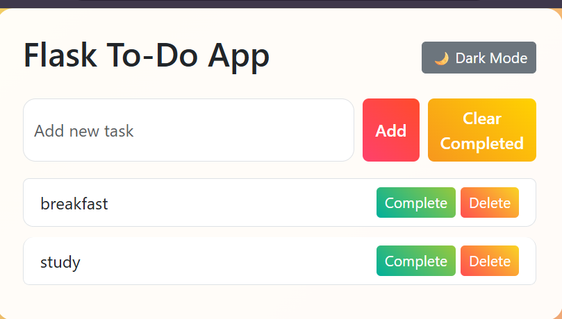
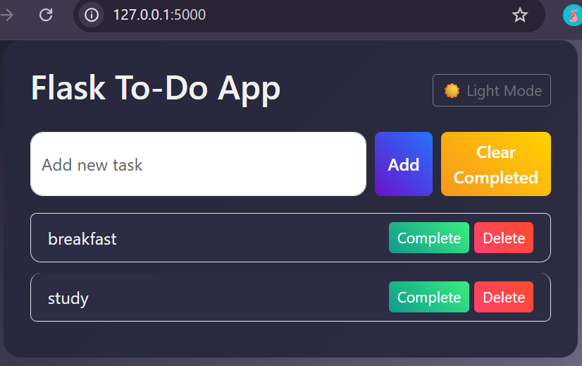

# Flask To-Do App

A simple, interactive To-Do web application built with **Flask**, **SQLite**, **Bootstrap**, and **JavaScript**. Users can **add, delete, complete, and reorder tasks**, with support for **dark mode** and colorful UI.

---

## 📝 Features

* Add new tasks dynamically
* Mark tasks as completed or undo completion
* Delete individual tasks
* Clear all completed tasks
* Drag-and-drop to reorder tasks
* Dark mode toggle
* Colorful, interactive UI using Bootstrap and custom CSS
* Persistent task storage with SQLite 

---

## 💻 Project Structure

```
flask_todo_app/
├── app.py
├── requirements.txt
├── README.md
├── templates/
│   ├── base.html
│   └── index.html
├── static/
│   ├── style.css
│   └── js/
│       └── main.js
└── screenshots/
    ├── screenshot1.png
    └── screenshot2.png
```

---

## 🚀 Installation

1. Clone the repository:

```bash
git clone https://github.com/your-username/your-repo.git
cd your-repo
```

2. Create a virtual environment (optional but recommended):

```bash
python -m venv venv
source venv/bin/activate   # Linux/macOS
venv\Scripts\activate      # Windows
```

3. Install dependencies:

```bash
pip install -r requirements.txt
```

4. Run the Flask app:

```bash
python app.py
```

5. Open your browser at:

```
http://127.0.0.1:5000/
```

---

## 🖼 Screenshots

**Home Page:**


**Dark Mode:**


---

## ⚙️ Usage

* Enter a task in the input box and click **Add**
* Click **Complete** to mark a task as done or **Undo** to unmark
* Click **Delete** to remove a task
* Click **Clear Completed** to remove all completed tasks
* Use **drag-and-drop** to reorder tasks
* Toggle **dark/light mode** using the button at the top

---

## 📦 Deployment

(Optional) You can deploy this app to **Render**, **Heroku**, or any Flask-compatible platform.

---

## 📌 Author

Your Name
[GitHub Profile](https://github.com/pawan-2003)


